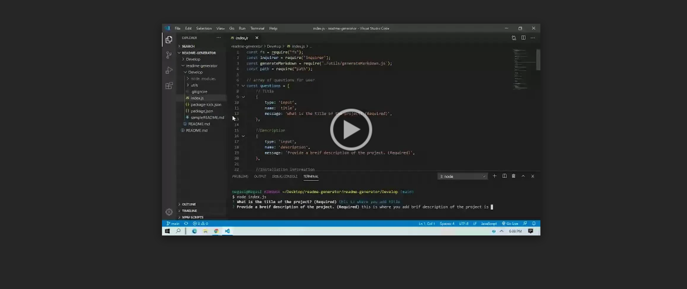

# readme-generator

   ## Description
   
   ## Table of Contents
   * [Installation Instructions](#installation-instructions)
   
   * [Usage Instructions](#usage-instructions)
   
   * [Contribution](#contribution)
   
   * [Developer Contact Information](#Developer-Contact-Information)
     
  * [License](#license)

   ## Installation Instructions
   
   ## Usage Instructions
   For  this application to run make sure first intall the node_moduale by
    "npm i or npm install".

  

  
  ## Contribution
  [negasimichael](https://github.com/negasimichael/readme-generator) is the only contrubuter of this project .

   ## Developer Contact Information
  * Linkedin Profile:[negasimichael](https://www.linkedin.com/feed/)
  * URL : N/A
  * Github URL:[negasimichael](https://github.com/negasimichael/readme-generator)
  * Email: negasimichael1@gmail.com

   ## License
   .

  